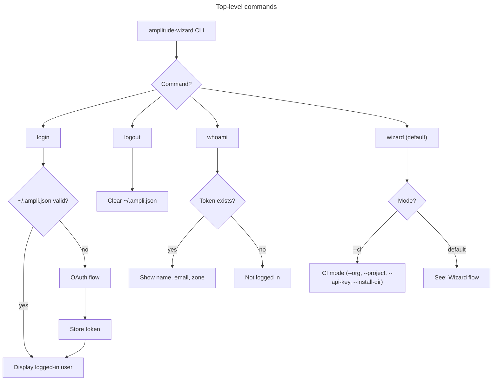
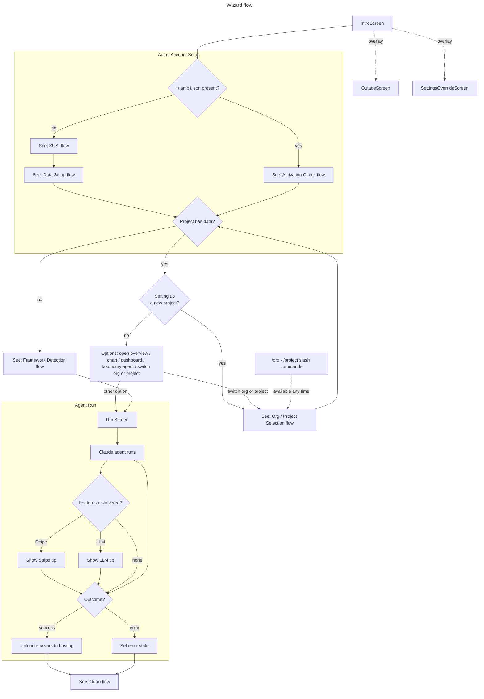
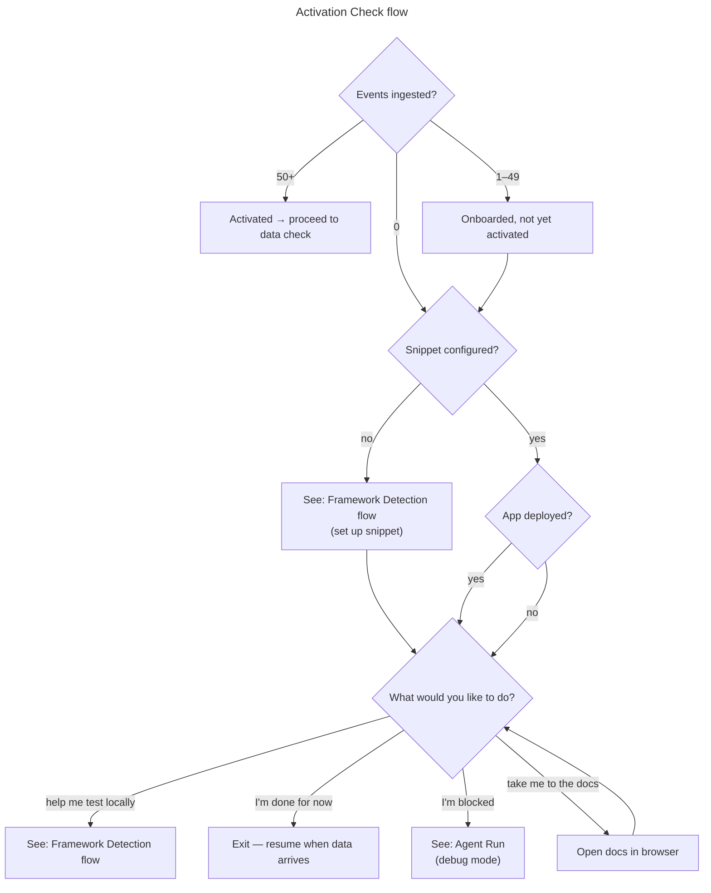
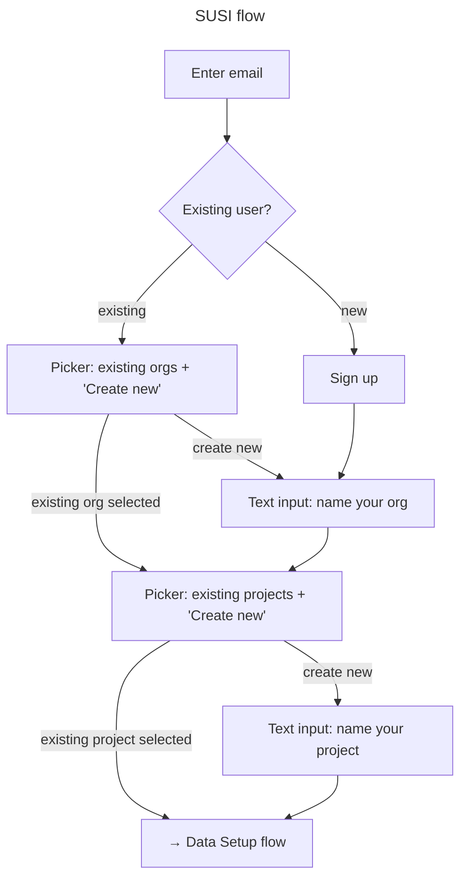
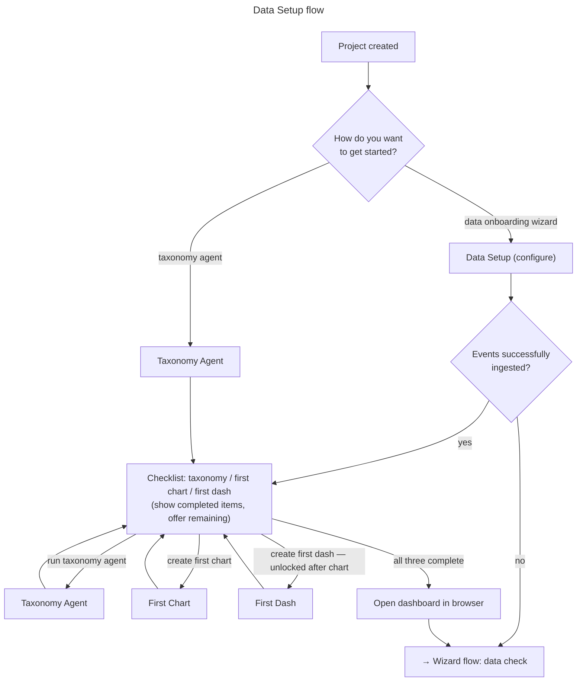
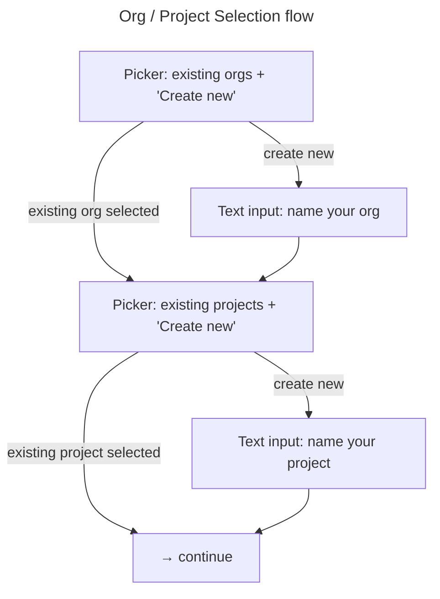
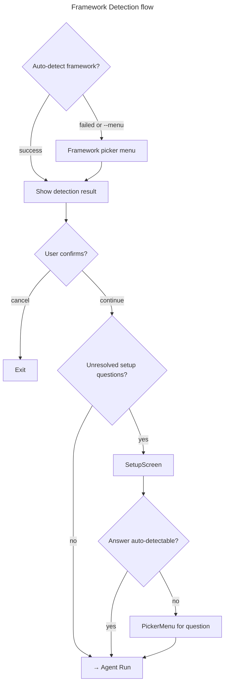
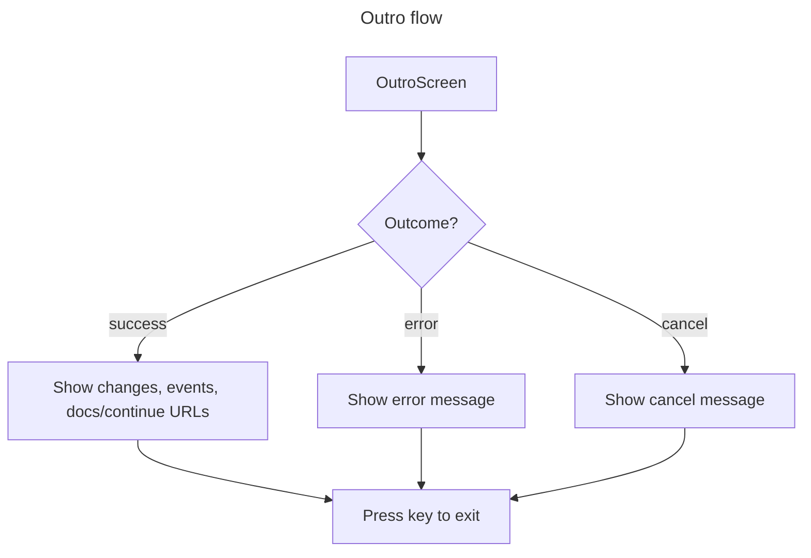

# CLI Flows

## Slash commands

The CLI keeps a persistent prompt open at all times (like Claude). Slash commands can be run at any point during the wizard to change settings or trigger actions.

| Command | Description |
|---|---|
| `/org` | Switch the active org |
| `/project` | Switch the active project |
| `/login` | Re-authenticate |
| `/logout` | Clear credentials |
| `/whoami` | Show current user, org, and project |
| `/overview` | Open the project overview in the browser |
| `/chart` | Set up a new chart |
| `/dashboard` | Create a new dashboard |
| `/taxonomy` | Interact with the taxonomy agent |
| `/help` | List available slash commands |

---

## Top-level commands

---

## Wizard flow

---

## Activation Check flow

---

## SUSI flow

---

## Data Setup flow

---

## Org / Project Selection flow

> Available as `--org` and `--project` CLI args in CI mode. In the wizard, `/org` and `/project` slash commands can invoke this at any time.

---

## Framework Detection flow

---

## Outro flow

