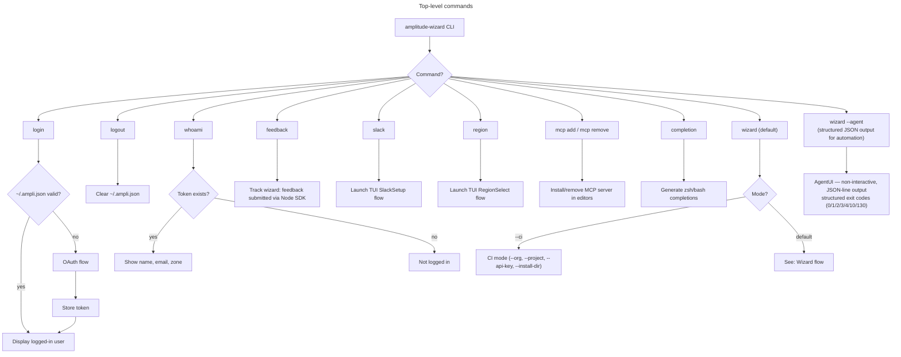
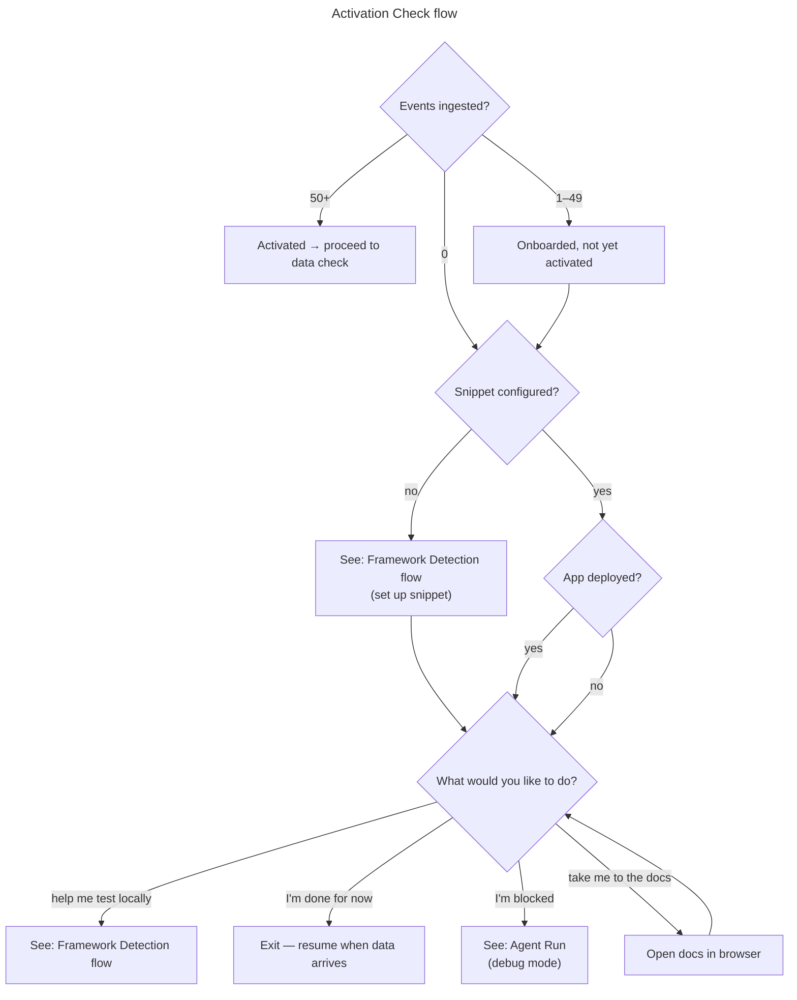
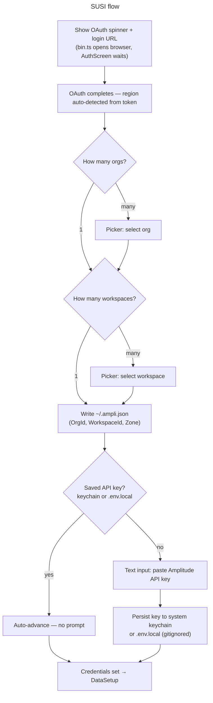
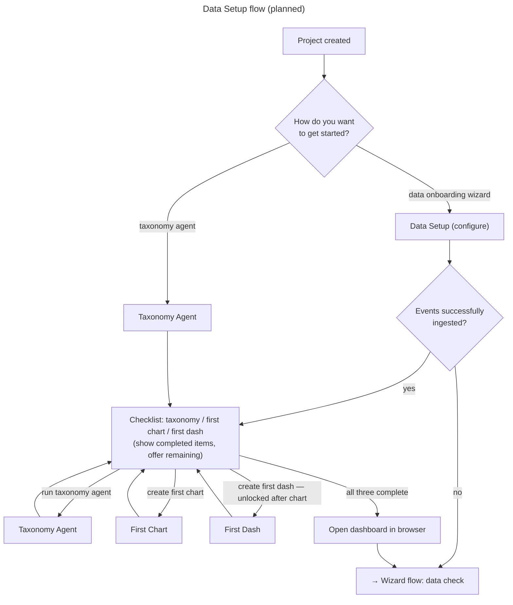
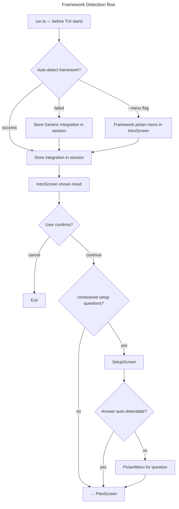
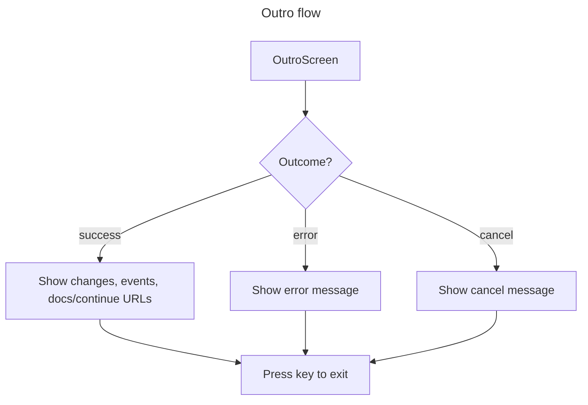

# CLI Flows

## Slash commands

The CLI keeps a persistent prompt open at all times (like Claude). Slash
commands can be run at any point during the wizard to change settings or trigger
actions.

| Command      | Description                                                       |
| ------------ | ----------------------------------------------------------------- |
| `/region`    | Switch the data-center region (US or EU) — re-triggers data setup |
| `/org`       | Switch the active org                                             |
| `/project`   | Switch the active project                                         |
| `/login`     | Re-authenticate                                                   |
| `/logout`    | Clear stored credentials                                          |
| `/whoami`    | Show current user, org, and project                               |
| `/mcp`       | Install or remove the Amplitude MCP server                        |
| `/slack`     | Set up Amplitude Slack integration                                |
| `/feedback`  | Send product feedback (event `wizard: feedback submitted`)        |
| `/test`      | Run a prompt-skill demo (confirm + choose)                        |
| `/snake`     | Play Snake                                                        |
| `/exit`      | Exit the wizard                                                   |

---

## Top-level commands

---

## Wizard flow

```mermaid
---
title: Wizard flow
---
flowchart TD
    INTRO["IntroScreen<br/>(shows detected framework — detection runs before TUI starts;<br/>falls back to generic if undetected · user confirms or exits)<br/>If a crash-recovery checkpoint exists for this project,<br/>the user is prompted to resume or start fresh"]
    INTRO --> REGION_SELECT

    REGION_SELECT["RegionSelect: US or EU?<br/>(Enter = US default · skipped for returning users)"]
    REGION_SELECT --> AUTH

    subgraph AUTH ["Auth / Account Setup (AuthScreen)"]
        SUSI["See: SUSI flow<br/>(OAuth → org → workspace → API key)"]
    end

    AUTH --> DATA_SETUP["DataSetupScreen<br/>(activation check — sets activationLevel: none / partial / full)"]
    DATA_SETUP --> DATA_CHECK{activationLevel?}

    DATA_CHECK -->|partial — SDK installed, few events| ACTIVATION_OPTIONS["ActivationOptionsScreen<br/>(help me test / I'm blocked / exit)"]
    DATA_CHECK -->|full — 50+ events| MCP_SCREEN
    DATA_CHECK -->|none — no SDK, no events| SETUP_Q

    ACTIVATION_OPTIONS -->|test locally or blocked| SETUP_Q
    ACTIVATION_OPTIONS -->|exit| OUTRO

    SETUP_Q{Unresolved setup questions?}
    SETUP_Q -->|no| RUN
    SETUP_Q -->|yes| SETUP["SetupScreen<br/>(per-framework questions)"]
    SETUP --> RUN

    SLASH_REGION["/region slash command"] -. available any time .-> REGION_SELECT

    subgraph AGENT_RUN ["Agent Run (RunScreen)"]
        RUN["RunScreen"] --> AGENT["Claude agent runs"]
        AGENT --> SDK_INSTALL["1. Install SDK + add initialization code"]
        SDK_INSTALL --> INSTRUMENT["2. Instrument events from approved plan"]
        INSTRUMENT --> IDENTIFY["3. User identification<br/>(scan for auth patterns · confirm_identify_plan · setUserId/identify/reset)"]
        IDENTIFY --> FEATURES{Features discovered?}
        FEATURES -->|Stripe| STRIPE_TIP["Show Stripe tip"] --> OUTCOME
        FEATURES -->|LLM| LLM_TIP["Show LLM tip"] --> OUTCOME
        FEATURES -->|none| OUTCOME
        AGENT --> OUTCOME{Outcome?}
        OUTCOME -->|success| POST["Upload env vars to hosting"]
        OUTCOME -->|error| ERR["Set error state"]
    end

    POST --> MCP_SCREEN["McpScreen<br/>(install MCP server · skipped on error)"]
    ERR --> OUTRO["See: Outro flow"]
    MCP_SCREEN --> DATA_INGESTION["DataIngestionCheckScreen<br/>(polls activation API every 30s · skipped on error)<br/>full users pass immediately · user can exit and resume later<br/>Shows rotating coaching tips while waiting<br/>On success: celebration animation with explicit 'continue' prompt"]
    DATA_INGESTION --> CHECKLIST["ChecklistScreen<br/>(first chart · first dashboard · taxonomy @todo)<br/>dashboard unlocks after chart · user can skip any item"]
    CHECKLIST --> SLACK_SCREEN["SlackScreen<br/>(connect Slack — skipped on error)"]
    SLACK_SCREEN --> OUTRO

    SUSI -. overlay .-> OUTAGE["OutageScreen"]
    RUN -. overlay, before agent starts .-> SETTINGS_OVR["SettingsOverrideScreen"]
```

---

## Activation Check flow

---

## SUSI flow

The SUSI flow runs inside `AuthScreen`. Authentication happens via Amplitude
OAuth (browser redirect). No email is entered in the wizard itself.

---

## Data Setup flow

> **Partially implemented.** `DataSetupScreen` sets `activationLevel` (none /
> partial / full). `DataIngestionCheckScreen` polls until events arrive.
> `ChecklistScreen` offers first chart and first dashboard via browser
> deep-links. Taxonomy agent and direct GraphQL chart/dashboard creation are
> planned. See `features/05-data-setup-flow.feature` for the full target
> behaviour.

---

## Framework Detection flow

> **Implementation note:** Detection runs eagerly in `run.ts` before the TUI
> starts. The result (or generic fallback) is stored in `session.integration`
> and displayed in `IntroScreen`, where the user confirms or exits. `--menu`
> skips auto-detection and shows a picker inside IntroScreen instead.

---

## Outro flow

