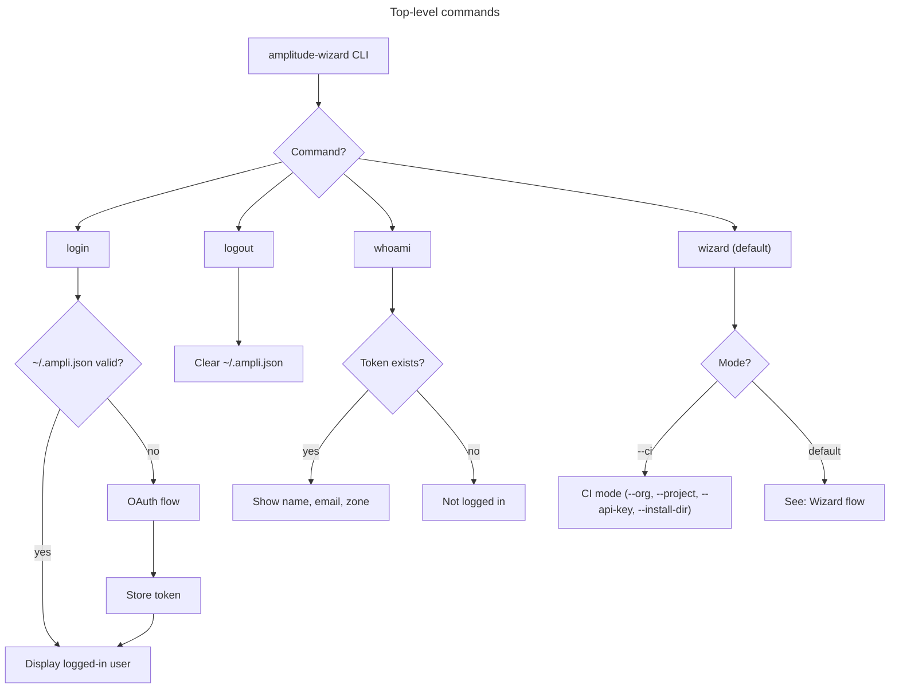
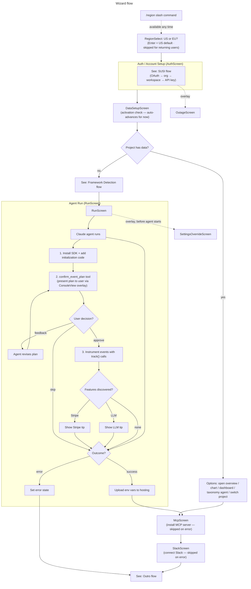
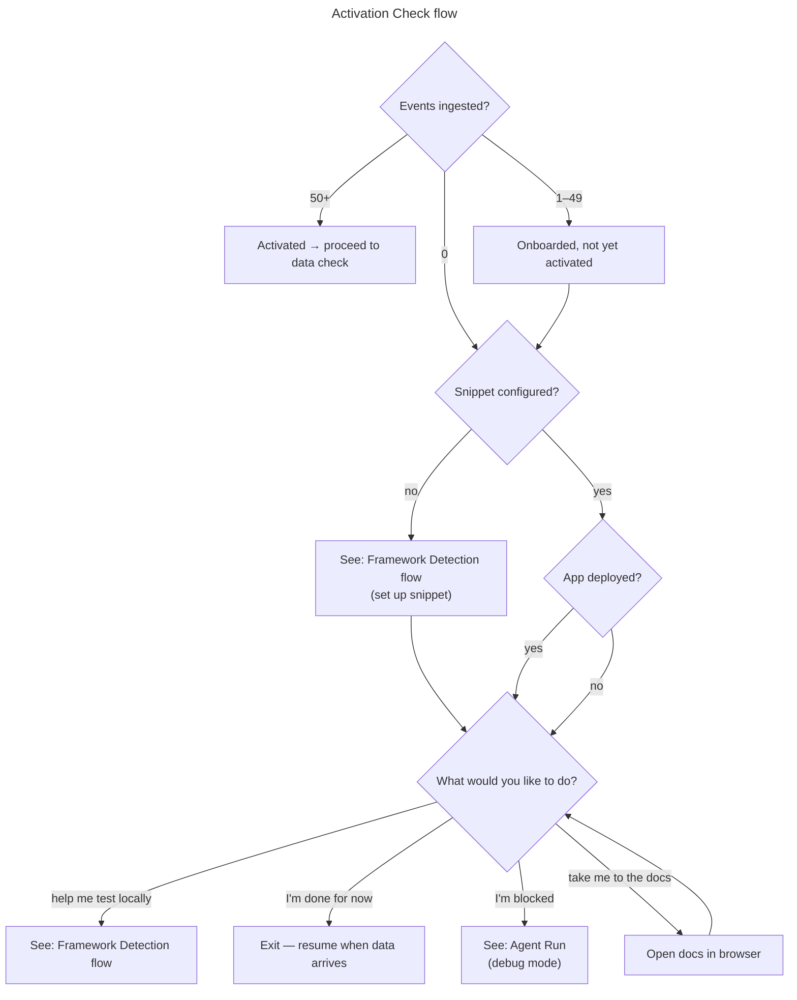
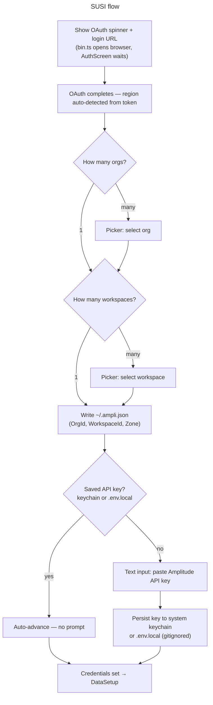
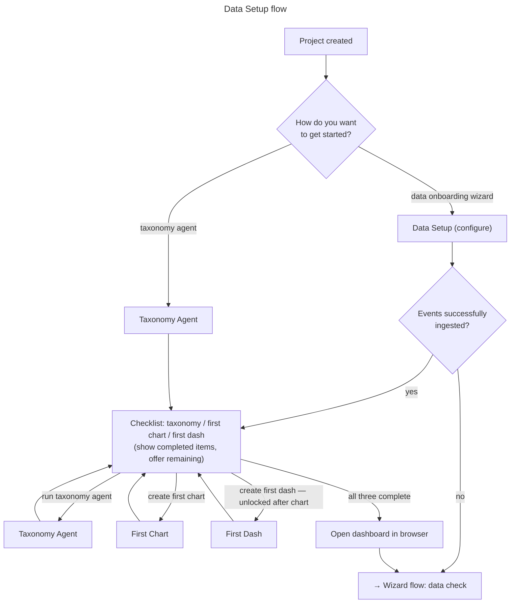
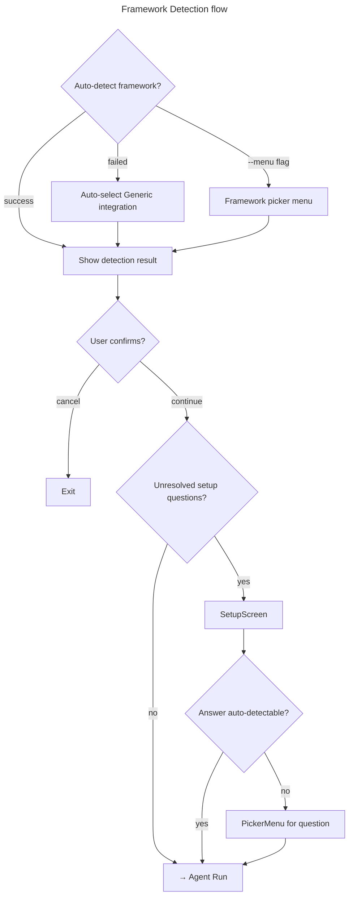
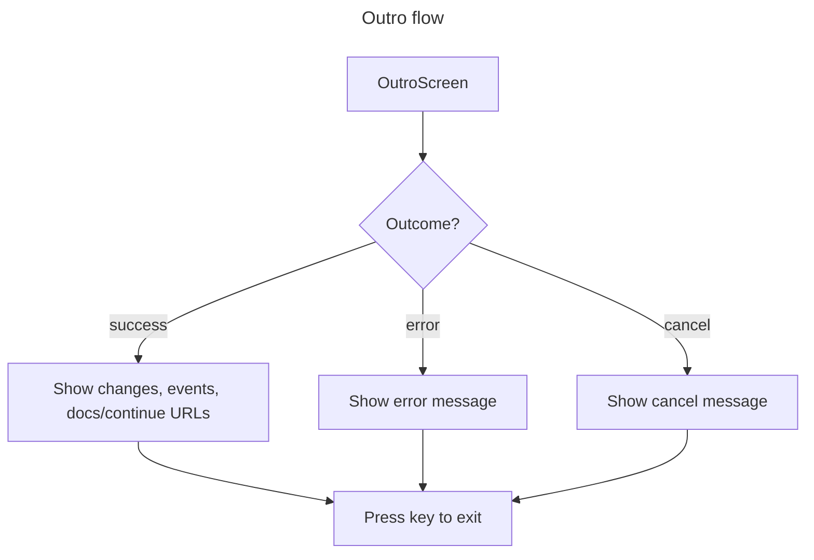

# CLI Flows

## Slash commands

The CLI keeps a persistent prompt open at all times (like Claude). Slash
commands can be run at any point during the wizard to change settings or trigger
actions.

| Command      | Description                                                       |
| ------------ | ----------------------------------------------------------------- |
| `/region`    | Switch the data-center region (US or EU) — re-triggers data setup |
| `/login`     | Re-authenticate                                                   |
| `/logout`    | Clear credentials                                                 |
| `/whoami`    | Show current user, org, and project                               |
| `/overview`  | Open the project overview in the browser                          |
| `/chart`     | Set up a new chart                                                |
| `/dashboard` | Create a new dashboard                                            |
| `/taxonomy`  | Interact with the taxonomy agent                                  |
| `/slack`     | Connect your Amplitude project to Slack                           |
| `/help`      | List available slash commands                                     |

---

## Top-level commands

---

## Wizard flow

---

## Activation Check flow

---

## SUSI flow

The SUSI flow runs inside `AuthScreen`. Authentication happens via Amplitude
OAuth (browser redirect). No email is entered in the wizard itself.

---

## Data Setup flow

---

## Framework Detection flow

---

## Outro flow

